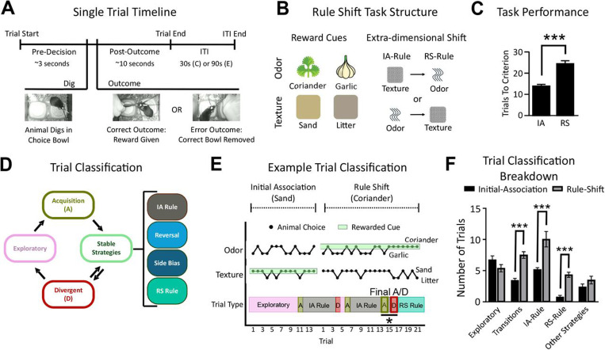
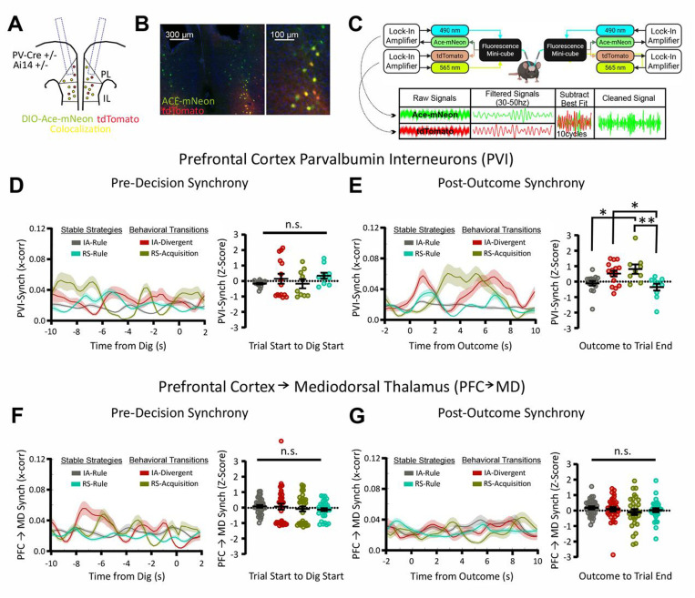
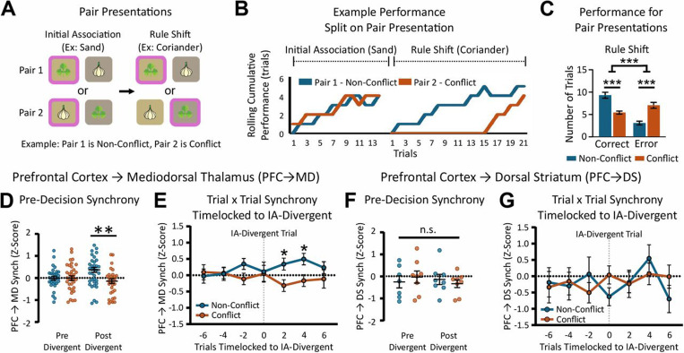
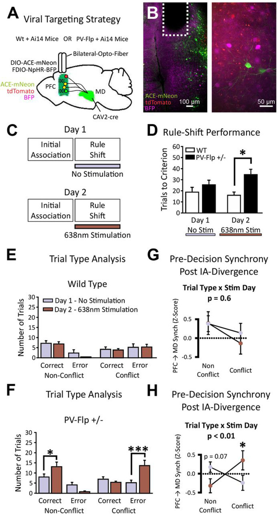
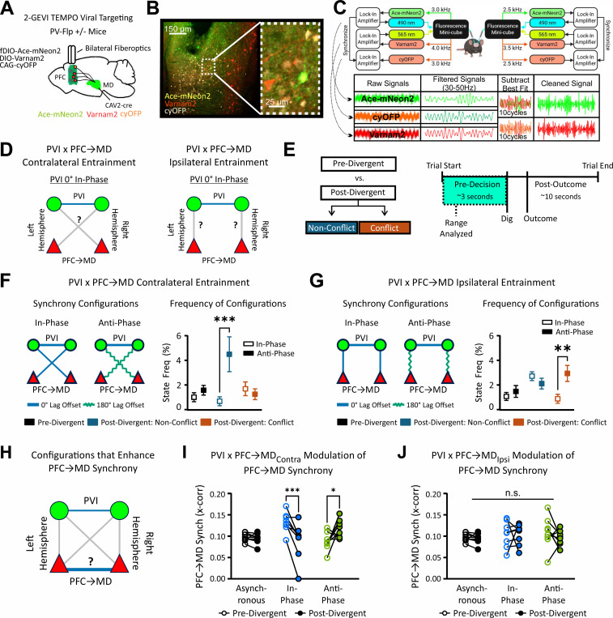

# Prefrontal gamma oscillations engage dynamic cell type-specific configurations to support flexible behavior

## 来源信息

- 题名：Prefrontal gamma oscillations engage dynamic cell type-specific configurations to support flexible behavior
- 作者：Aarron J. Phensy, Lara L. Hagopian, Caitriona M. Costello, Simon Haziza, Omkar Ghenand, Yanping Zhang, Mark J. Schnitzer, Vikaas S. Sohal
- 公开版本：bioRxiv/PMC preprint version 3, 2025-09-10
- DOI：10.1101/2024.03.08.584173
- PMID：40799566；PMCID：PMC12340850
- 说明：我检索到的公开全文页面将该文标注为 preprint，未在公开索引中确认到 Neuron 正式发表页面。因此本总结基于 PMC/bioRxiv v3 全文和主文图。
- 本地 PDF：`Prefrontal_gamma_oscillations_Phensy_2025_bioRxiv_PMC.pdf`

## 简要背景

精神分裂症等神经精神疾病常伴随认知灵活性受损，这类缺陷与前额叶皮层 PFC、丘脑内侧背核 MD、纹状体等环路的异常沟通有关。PFC 中的 parvalbumin 阳性抑制性中间神经元（PVI）被认为是皮层 γ 频段振荡的重要来源，γ 振荡又常被用于解释执行控制、学习和灵活行为。但传统观点往往把 γ 振荡看成一种较统一的局部微环路同步现象，难以解释同一频段活动如何同时承担不同的行为功能。

这篇文章的核心问题是：PVI 介导的前额叶 γ 同步是否会以细胞类型、投射通路、半球关系和相位关系特异的方式动态组织，并在规则转换学习中的不同认知需求下被选择性调用。作者重点考察 PVI、PFC->MD 投射神经元、PFC->DS 投射神经元之间的 γ 同步关系，以及这些关系在行为策略转换、冲突选择和 PVI 光遗传抑制条件下如何改变。

## 方法详述

### 动物和遗传工具

研究使用雌雄小鼠。行为实验期间小鼠转入反向明暗周期、单笼饲养，并约 1 周限食至基线体重的 85%。不同实验使用不同遗传背景：

- PV-Cre x Ai14 小鼠用于在 PFC 的 PVI 中表达 Ace-mNeon 和 tdTomato，检测 PVI γ 同步。
- Ai14 小鼠配合逆行 CAV2-Cre，用于标记 PFC->MD 或 PFC->DS 深层投射神经元。
- PV-Flp x Ai14 小鼠用于 PVI 光遗传抑制实验，使 PFC->MD 神经元表达 GEVI，同时使 PVI 表达 Flp 依赖的 halorhodopsin/NpHR。
- PV-Flp 小鼠用于双颜色 GEVI 实验，同时记录 PVI 和 PFC->MD 神经元的电压动态。

### 病毒载体

单细胞类型 TEMPO 实验使用 AAV1-CAG-DIO-Ace2N-4AA-mNeon 表达绿色 GEVI，并用 tdTomato 作为参考荧光。双 GEVI 实验使用 Ace-mNeon2 标记 PVI、Varnam2 标记 PFC->MD 神经元，并用 cyOFP 作为宽泛表达的参考荧光，用于去除非电压相关的光学伪影。光遗传抑制实验使用 Flp 依赖的 NpHR3.3-BFP。

### 行为任务：extra-dimensional rule shift

小鼠执行碗中挖掘规则转换任务。每次试验给小鼠两个碗，每个碗由气味和质地组成复合线索，例如 garlic/sand、coriander/litter 等。任务分两阶段：

1. Initial Association（IA）：小鼠先学习一种线索维度上的奖励规则，例如选择含 sand 的碗，此时气味维度可被忽略。
2. Rule Shift（RS）：奖励规则未经提示地切换到另一维度，例如从 texture rule 切到 odor rule，小鼠必须忽略旧规则并使用新规则。

每阶段达到 10 次中 8 次正确的标准后进入下一阶段或结束。作者改进了任务流程：正确选择后实验者用镊子给予奖励，错误选择后移走正确碗，从而提供更精确、可与神经信号对齐的 outcome 时间点。RS 试验进一步分为 non-conflict 和 conflict：non-conflict 中旧规则和新规则指向同一碗，按旧规则也会正确；conflict 中旧规则和新规则指向不同碗，若坚持旧规则会产生 perseverative error。

### 行为策略分类算法

作者不是只按正确/错误分析行为，而是为每个 trial 估计小鼠是否处于稳定策略、探索状态或策略转移。算法假定小鼠可能采用 6 种基本策略：4 种 cue-based 策略（如 litter、sand、garlic、coriander）和 2 种 side-based 策略（left/right）。

每个 trial 计算 3 个指标：

- PPS：过去 6 次选择中符合某一策略的比例。
- FPS：当前和未来 5 次选择中符合某一策略的比例。
- CTP：基于过去 6 次选择历史预测当前选择的概率。

PPS 和 FPS 对最靠近当前 trial 的 3 个 trial 加权更高。CTP 通过带 ElasticNet 正则化的 logistic regression 估计，并用 10 折交叉验证。随后作者对 PPS、FPS、CTP 做 KNN 聚类，并据此设定 stable、divergent、exploratory 等分类阈值。算法还用 50,000 次模拟 trial 验证，评估 switch detection accuracy、sensitivity、precision 和 overall classification accuracy。

### 手术与记录

所有病毒注射和光纤植入均使用立体定位。PFC 注射后等待至少 5 周表达。PVI 记录实验在双侧 mPFC 注射 Ace-mNeon 病毒并植入双侧光纤。PFC->MD/PFC->DS 实验在 mPFC 注射 Cre 依赖 GEVI，同时在 MD 或 DS 注射 CAV2-Cre 逆行标记相应投射神经元。PVI 抑制实验同时在 PFC 表达 PFC->MD GEVI 与 PVI-NpHR，并使用 638 nm 光进行抑制。双 GEVI 实验同时表达 Ace-mNeon2、Varnam2 和 cyOFP，以双侧光纤记录两类细胞的快速电压信号。

### TEMPO 光纤电压记录

TEMPO 通过调制 LED、lock-in amplifier 解调和高速采集来读取 GEVI 荧光。单细胞类型实验记录 Ace-mNeon 电压信号和 tdTomato 参考信号；双细胞类型实验记录左右半球各 3 个通道：Ace-mNeon2、Varnam2、cyOFP。cyOFP 因激发和发射特性可作为参考，用于校正两个 GEVI 通道中的运动、血流、光纤弯曲等非电压噪声。

### γ 同步分析

原始数据经 Synapse 采集后转换为 MATLAB 结构。信号先带通滤波到 30-50 Hz γ 频段。作者在 250 ms bin 内使用线性回归去除 GEVI 与参考通道共享的非电压成分。跨半球 γ 同步用左右 mPFC 清理后电压信号的 zero-lag Pearson correlation 计算，并以任务前 10 分钟 baseline 做 z-score。

为分析相位结构，作者将两个信号在一个 40 Hz 周期内按 22.5 度步进相对平移，寻找最大相关对应的相位关系。最大相关位于 -45 到 +45 度定义为 in-phase；位于约 135 到 225 度定义为 anti-phase。双 GEVI 分析进一步识别 PVI 与同侧或对侧 PFC->MD 神经元之间的 in-phase/anti-phase 配置，并询问这些配置如何影响 PFC->MD 跨半球 γ 同步。

### 分析验证

作者用三类控制验证同步分析不是伪影：第一，用含已知同步片段的模拟信号测试 pipeline 能否恢复真实同步；第二，对真实 PVI 数据做 Fourier phase-scrambling，保留功率谱但打乱相位，结果原本的 trial-locked 同步消失；第三，计算 Ace-mNeon 电压通道与 tdTomato 参考通道之间的同步，未见显著同步，支持主效应来自电压动态而非共同噪声。

## 结果阐述

### 1. 规则转换不是单纯随机探索，而是稳定策略之间的动态转移

RS 阶段比 IA 阶段需要更多 trial 才能达到学习标准。更重要的是，策略分类显示小鼠在规则转换中并非只是随机探索，而是在旧规则、侧偏、回归策略、新规则等稳定或半稳定策略之间切换。RS 阶段中 transition 相关 trial 和 stable policy trial 均增加，说明认知灵活性可以被解析为策略状态的重组过程。

### 2. PVI 跨半球 γ 同步在行为策略转换后的 outcome 窗口增强

作者用 PVI 特异 Ace-mNeon TEMPO 记录双侧 mPFC PVI 活动。PVI 跨半球 γ 同步在 pre-decision 窗口没有显著 trial type 调制，但在 post-outcome 窗口，IA-Divergent 和 RS-Acquisition 等与策略转换相关的 trial 上显著增强。这说明 PVI γ 同步更像是与结果反馈后策略更新相关，而不是简单编码选择前动作或稳定策略执行。

### 3. PVI 的 post-outcome 同步不会自动传递到所有投射神经元

如果 PVI γ 同步只是全局微环路同步，PFC->MD 或 PFC->DS 投射神经元也应在相同窗口出现对应增强。但作者发现 PFC->MD 和 PFC->DS 神经元在 IA-Divergent 或 RS-Acquisition 的 post-outcome 窗口均没有类似增加。因此，PVI γ 同步并非自动、均一地驱动所有局部兴奋性投射群体。

### 4. PFC->MD γ 同步在选择前编码 conflict/non-conflict 差异

在 RS 阶段，non-conflict trial 中旧规则和新规则会导向同一选择，而 conflict trial 要求小鼠抑制旧规则。行为上，小鼠在 conflict trial 表现更差，符合 perseveration。神经上，PFC->MD 跨半球 γ 同步在 IA-Divergent 之前不区分 conflict 与 non-conflict；在 IA-Divergent 之后，pre-decision 窗口中 non-conflict 的 PFC->MD 同步高于 conflict，且差异主要出现在 IA-Divergent 后最初几个 trial。相同分析在 PFC->DS 神经元中未出现，提示这一效应具有投射通路特异性。

### 5. 抑制 PVI 会破坏规则转换和 PFC->MD 同步模式

作者在 Day 1 无光、Day 2 用 638 nm 抑制 PFC PVI。PVI 抑制使规则转换学习受损，并增加 perseveration：non-conflict 中按旧规则仍可正确，因此正确选择增多；conflict 中旧规则导致错误，因此错误增多。神经上，PVI 抑制改变了 IA-Divergent 后 PFC->MD pre-decision γ 同步的 trial-type 模式：conflict trial 上本应较低的同步升高，non-conflict 上同步有下降趋势。该结果支持 PVI 对 PFC->MD γ 同步的行为相关调控具有因果作用。

### 6. 双 GEVI 显示不同 trial type 调用不同 PVI-PFC->MD 相位配置

双 GEVI 实验同时记录 PVI 和 PFC->MD 神经元。作者发现，在 PVI 跨半球 in-phase γ 同步发生时，PVI 与 PFC->MD 神经元可形成不同的同侧/对侧、in-phase/anti-phase 配置。IA-Divergent 后，non-conflict trial 选择性增加 PVI 与对侧 PFC->MD 神经元的 anti-phase 配置；conflict trial 则选择性增加 PVI 与同侧 PFC->MD 神经元的 anti-phase 配置。这是一个双重分离，说明 γ 振荡功能取决于具体细胞类型、投射通路、半球方向和相位关系。

### 7. 主要结论

这篇文章的结论不是“γ 同步增加支持灵活行为”这么简单，而是：前额叶 γ 振荡由多个可分离的同步 motif 组成。PVI 相关同步在 outcome 后参与策略更新；PFC->MD 同步在 decision 前反映规则转换后 conflict/non-conflict 的行为需求；PVI 通过同侧或对侧的 PFC->MD 相位配置动态组织这些同步关系。因此，γ 振荡应被理解为细胞类型和环路特异的动态配置，而非单一、全局、微环路范围内的节律。

## 主文图像与说明

### Figure 1 - Behavioral framework reveals dynamic strategy transitions during rule shift learning

文件：`figures/figure_1_behavioral_framework.png`

该图建立行为任务和分析框架。A-B 展示单 trial 时间线、复合气味/质地线索以及 IA 到 RS 的规则转换。C 显示 RS 比 IA 需要更多 trial 才达到标准。D-E 展示作者如何用过去和未来 trial 的可预测性给每个 trial 分类。F 表明 RS 阶段包含更多策略转换和稳定策略相关 trial，说明学习不是单纯随机探索，而是策略状态的动态重排。

### Figure 2 - Interhemispheric gamma synchrony between prefrontal PV interneurons increases specifically after behavioral transitions

文件：`figures/figure_2_pvi_interhemispheric_gamma.png`

该图显示 PVI γ 同步的时间窗和细胞类型特异性。A-C 给出 PVI GEVI 标记、组织学验证和 TEMPO/信号处理流程。D-E 表明 PVI 跨半球 γ 同步不是在选择前普遍升高，而是在 outcome 后、与策略转换相关的 IA-Divergent 和 RS-Acquisition trial 上增强。F-G 显示 PFC->MD 投射神经元在同类窗口没有对应增加，说明 PVI 同步不会自动传播到该投射群体。

### Figure 3 - Conflict-dependent modulation of gamma synchrony in PFC->MD neurons during decision-making

文件：`figures/figure_3_pfc_md_conflict_gamma.png`

该图聚焦选择前 PFC->MD γ 同步如何随任务冲突改变。A-C 定义 conflict 与 non-conflict trial，并显示 conflict trial 更容易暴露 perseveration。D-E 表明 IA-Divergent 后，PFC->MD 跨半球 γ 同步在 non-conflict trial 中高于 conflict trial，且差异主要出现在策略偏离旧规则后的最初几个 trial。F-G 显示 PFC->DS 神经元没有这种调制，提示效应是 PFC->MD 通路特异的。

### Figure 4 - Optogenetic inhibition of prefrontal PV interneurons disrupts rule-shift learning and learning-induced patterns of synchrony in PFC->MD neurons

文件：`figures/figure_4_pvi_opto_inhibition.png`

该图提供因果证据。A-C 展示在 PFC->MD 神经元记录 GEVI 的同时，用 NpHR 抑制 PVI 的病毒策略、组织学和两天实验设计。D-F 显示 PVI 抑制损害规则转换，并增加旧规则驱动的 perseveration。G-H 显示在对照动物中光照不改变 PFC->MD γ 同步，而在 PVI 被抑制的动物中，conflict/non-conflict 的同步模式被打乱，支持 PVI 是 PFC->MD 动态同步配置的必要调节节点。

### Figure 5 - Dual-GEVI voltage measurements reveal that PVIs and PFC->MD neurons adopt distinct, behaviorally-specific synchrony configurations during learning

文件：`figures/figure_5_dual_gevi_configurations.png`

该图是全文机制核心。A-C 展示双 GEVI 和 cyOFP 参考信号策略，可同时解析 PVI 与 PFC->MD 神经元的电压动态。D-E 定义 PVI 与同侧/对侧 PFC->MD 神经元的 in-phase 与 anti-phase 配置，并对 IA-Divergent 前后进行比较。F-G 显示 non-conflict trial 选择性增加 PVI-对侧 PFC->MD anti-phase 配置，conflict trial 选择性增加 PVI-同侧 PFC->MD anti-phase 配置。H-J 进一步说明，对侧 PVI-PFC->MD 相位配置能解释 PFC->MD 跨半球 γ 同步在学习阶段中的改变。
